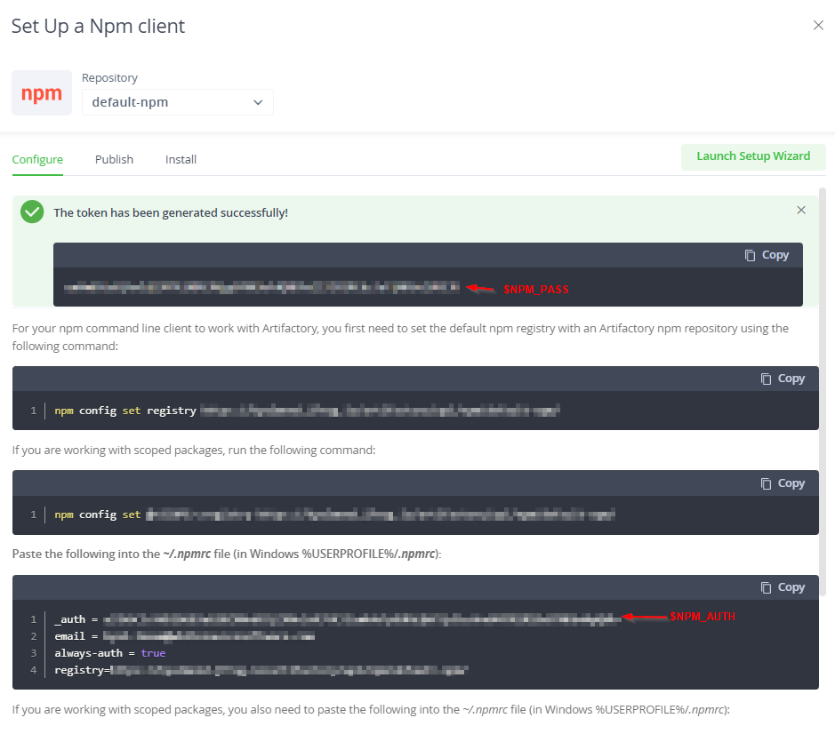

## Configuring Private Registries without Host Rules For Self-Hosted Repository Integrations

There are often security policies among many organizations that restrict reaching out to public registries such as Maven Central. This is the default repository for downloading dependencies with Maven. In instances such as this, Mend provides the ability to specify host rules inside of the repository.

For Self-hosted Repository Integrations, there is another way of specifying host rules without any need to specify Host Rules inside of the repo, or even at the global level. This can be configured at the container level for ease of configuration, privacy, and to prevent tampering.

### Steps:
1. Create sensible environment variables. In the example [docker-compose.yml](./docker-compose.yml) file, we use MVN_USER, MVN_PASS, MVN_RELEASES, and MVN_SNAPSHOTS to specify credentials and URL's respectively.
2. Create a package manager settings file such as a [settings.xml](./settings.xml) where these environment variables can get injected. In the example above, we can access these environment variables with `${env.<VARIABLE_NAME>}`.
3. For Remediate/Renovate specifically, you can create a [config.js](./config.js) to direct Remediate/Renovate to your desired registry. In this file, we can use `module.exports` to specify the remediate configuration just as if it were in a global configuration. The great thing about this configuration is that the password does not need to be encrypted. You can keep it as plaintext as it remains on the container and never leaves.
4. Map the appropriate files and variables to the scanner and remediate container. This is demonstrated in the [docker-compose.yml](./docker-compose.yml).
5. In both the scanner and the remediate container, specify extra_hosts with the default public registry pointing to 127.0.0.1. This will effectively block the public registry from being used by the container.

### Explanations:
#### Maven
With Maven, adding environment variables to the settings.xml is as easy as ${env.<environment_variable_name>}. Therefore, if you take any generic settings.xml, and set the servers and credentials to environment variables. Then this can be handled when starting up the container by adding the environment variables either to the docker command with `-e` or by using the `environment:` option when specifying the container in a docker-compose.yml file. For the scanner, all you need to do is map the settings.xml into the .m2 directory. For the remediate container, you need to map the config.js file into the `/usr/src/app` directory and set the environment variables accordingly. For the config.js, you can access environment variables by using the directive `process.env.<variable_name>`

#### NPM
NPM is not too different than maven. The major difference is that, you need different credentials for the scanner and for the Remediate container. For the scanner, you need the NPM Auth Token that is provided by Artifactory. For the Remediate container, you need the username and password provided by Artifactory. The only other difference is that for environment variables in the .npmrc file, you can just specify ${<variable_name>}. Below is an image showing the NPM Password and the NPM Auth Token.

